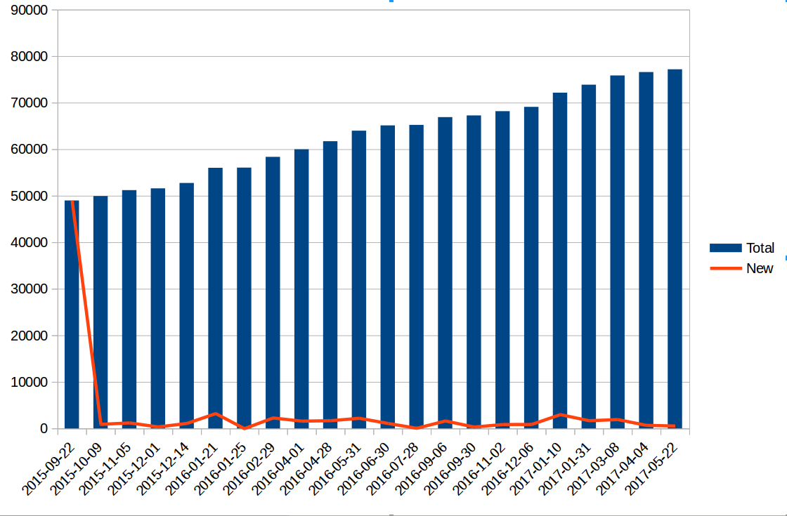
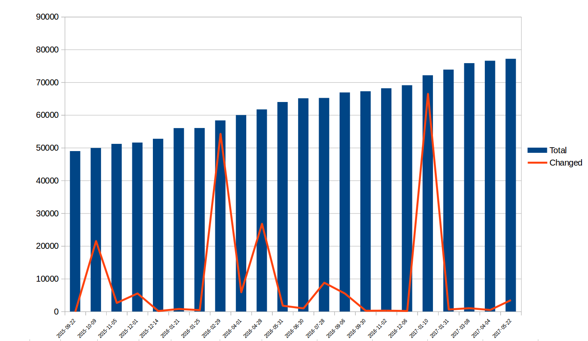
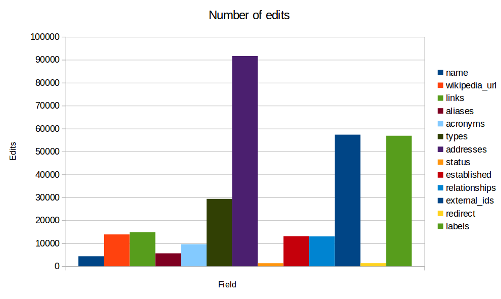
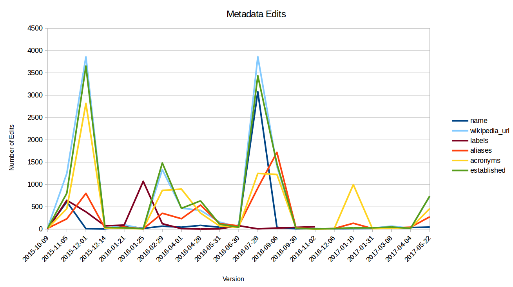
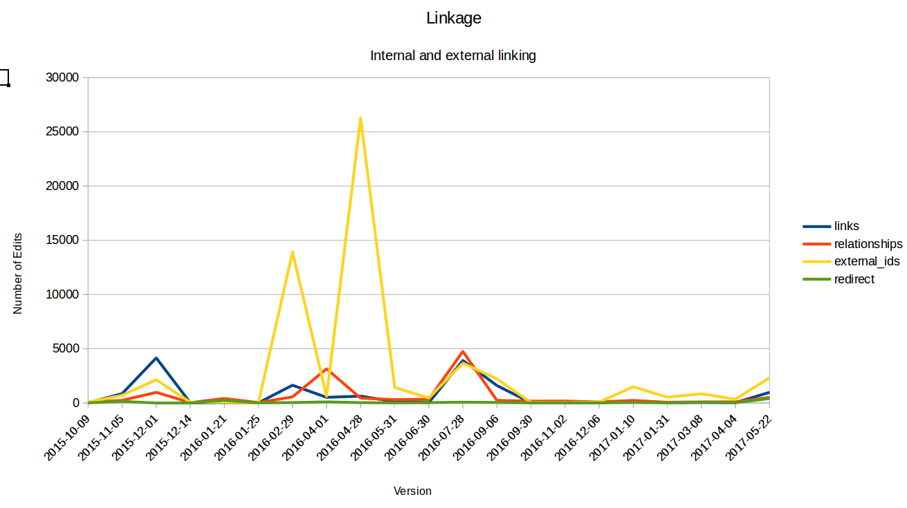

# Exploring the growth of the Grid dataset

The [Global Research Identifier Database](https://grid.ac) is a public domain database containing 
data about research organisations. 

The dataset is intended to provide both unique identifiers for organisations and openly licensed metadata to enable 
better integration and use of data relating to academic research, publications and funding.

The dataset was first published in September 2015 and at the time of writing has been released 22 times. This repository 
contains some code and data that explores how the GRID dataset has evolved over these releases.

Understanding the ways in which a dataset evolves can help:

* assess the level of investment and effort required to maintain the dataset
* highlight how the structure and content of a dataset is changing
* identify areas where additional tooling or support might be useful

## The Data

Three data files have been generated and published with this repository. The data was generated on 
30th June 2017 and reports on 22 versions of the GRID dataset, up to and including the 2017-05-22 release.

* [properties.csv](data/properties.csv) -- list of properties in the dataset and version numbers in which they occur
* [growth.csv](data/growth.csv) -- stats on growth and revisions to the data and statuses
* [edits.csv](data/edits.csv) -- stats on how many edits have been made to individual properties and estimates on the extent of the changes

See the notes below for instructions on how to regenerate the files. The discussion section provides more context 
to the datasets.

The data is has been placed into the public domain under the [Creative Commons CC0 1.0](https://creativecommons.org/publicdomain/zero/1.0/) waiver.

## Updating the Reports

The analysis is primarily done using Ruby. You'll need to install Ruby 2.4.0, rubygems and bundler. 

The schema for each release of the dataset is extracted using the [generate-schema](https://github.com/ldodds/generate-schema) 
tool which is used to produce a JSON Schema from each version of the `grid.json` file. 

You'll need to install the version of the application linked here as it includes an 
important [bug](https://github.com/nijikokun/generate-schema/issues/27) fix.    

With these dependencies installed you can download and unpack the releases by running:

```
rake setup:all
```

This will download all the datasets listed in `config/datasets.json`. (An improvement to this process 
would be to [use the Figshare API](https://gridac.freshdesk.com/support/solutions/articles/6000175485-how-can-i-automate-a-download-))

Then to run the reports:

```
rake report:all
```

This will extract the schemas and then run the code to generate the three CSV files.

## Discussion

The structure of the GRID dataset is [documented here](https://grid.ac/format).

GRID also provide some [high-level statistics](https://grid.ac/stats) on the dataset, including a breakdown of types, country 
coverage and detail available about each institution.

GRID also provide access to [all historical releases of the dataset](https://grid.ac/downloads). There are 22 of 
these at the time of writing. Accompanying each release are some brief change notices.

None of the following analysis is meant to imply anything about the quality of the GRID dataset or the editorial practices 
of Digital Science. It's a simple investigation into the evolution of a publicly available dataset.

### How has the dataset structure evolved?

The [properties.csv](data/properties.csv) data file lists all of the properties associated with an "institute" in the 
GRID dataset.

The schema information was extracted from the JSON version of each dataset using the `generate-schema` too. This allows
us to explore how the schema has evolved between versions.

While many properties in the dataset are simple string values, others refer to arrays and/or nested objects. To present 
a simple tabular view of the schema, properties of nested objects are prefixed. So, for example 
the `addresses.city` property refers to the `city` property of objects that are found as the 
value of an institutions `addresses` property.

The columns in the CSV file indicates in which version of the release a specific property has been used.

Reviewing the table we can see that there have been three key changes to the structure of the dataset:

* The 2016-02-29 release of the dataset introduced the `labels` property which provides translated names for 
each institution using data from Wikidata. The range of external identifiers was also updated to include [OrgReg](http://www.orgref.org/web/index.htm), 
Wikidata and [CNRS](http://www.cnrs.fr/index.php)

* The 2016-04-28 release revised the structure of the `external_ids` property. Previously the property had been simple key-value 
pairs, but was revised to allow for a list of identifiers for each external source to be provided along with an indication of the 
"preferred" identifier.

* In the 2017-01-10 release, the `geonames_city` property was extended to include a `license` field containing a Geonames 
attribution and a link to their licence. This is slightly unusual as normally attribution would be given at the dataset, rather than 
record level. However, while GRID itself is published under a CC0, the data from Geonames is published under a CC-BY licence. Presumably the inclusion of 
this finer grained attribution is to help clarify this relationship.

So far GRID has only extended its schema: properties have been added or revised but not removed. However while some properties 
are included in the data and documentation, they are very rarely populated. For example the `email_address` property 
has only ever contained a single value.

The only breaking change to the structure of the dataset was the 2016-04-28 release and the change was noted to end 
users.

Some minor schema changes have gone unreported and undocumented, e.g. the inclusion of the geonames attribution or the addition of 
CNRS identifiers. The full list of sources of external identifiers also doesn't seem to be documented, so must be identified from the data itself.

The spreadsheet highlights an apparent anomaly in the inclusion of LinkedIn identifiers for institutions. The properties are found in 
some, but not all releases. This is likely to be a side-effect of corrections or changes to the data. There are only 
a small number of these identifiers so removing will mean they are no longer present in the derived schema. 

But this does suggest a very minor inconsistency in how missing values are presented in the data: other properties are always 
included, but with null values, whereas `external_ids` may only be included if data is available.

### How has the dataset grown?

The [growth.csv](data/growth.csv) data file has the following columns:

* Version -- version number of the release
* Total -- total number of institutions in the dataset
* New -- number added since last release
* Deleted -- number deleted since last release
* Changed -- number of records revised since last release
* Active -- number of institutions with an "active" status
* Redirected -- number of institutions with a "redirect" status
* Obsolete -- number of institutions with an "obsolete" status

Since Sept 2015 GRID has grown from 48,987 to 77,177 records, so is now around 1.5 times bigger since it was originally 
released. 

No institutes have been deleted from the dataset. The policy is to mark duplicates with a "redirected" status. The record is 
also updated with a reference to the master version. A very small number are marked as "obsolete". Of these 280 records, 277 have 
been obsolete since the first release. 

In total, 97% of the dataset are active institutions, the redirected and obsolete records account for only 3% of the dataset.

While the dataset is growing, as the following graph shows, the additions have been fairly even. Excluding the initial 
release, each new version includes, on average, 2% more records.

  

Changes to existing records are more sporadic and are at times far-reaching. The following graph shows the total number of 
records and the number of changed records for each release. A change has been counted wherever there has been an update 
to a record, regardless of how minor the edit may have been.

  

There have been four occasions where more than 40% of the dataset has been revised in some way. These are:

* 2015-10-09 (43%) -- the release notes indicate that "Coverage of institutes with types increased from 33% to 76%" 
* 2016-02-29 (93%) -- this was the date that labels were imported from Wikidata
* 2016-04-28 (43%) -- this was due to the revisions to the schema relating to the `external_ids` and additional sources
* 2017-01-10 (92%) -- while not explicitly noted in the change log, this appears to be down to changes to the `addresses` field

Excluding these events, each release includes, on average edits to approximately 4% of the records in the system.

Note: the count of changes may be slightly inflated currently as the counts include changes where a key has changed 
value from a null value to an empty string. But while these changes occur they are not thought to be significant in 
number.

### How has the dataset been edited?

The [edits.csv](data/edits.csv) data file contains the following columns:

* Property -- the property being edited
* Version -- version number of the release
* Edits	-- number of edits to that property in the release
* Min Distance	-- a measure of size of edit, see below
* Max Distance	-- see below
* Average Distance -- see below

The "distance" measure for a property depends on its type. For string fields (e.g. `name`) it is the 
[Damerau–Levenshtein distance](https://en.wikipedia.org/wiki/Damerau%E2%80%93Levenshtein_distance) between the two 
values. So a measure of the number of changes to the text.

For arrays the distance is a count of the number of values removed and/or added to the array. So if an array with 
two values ("a", "b") is replaced with a similar two value array ("b", "c") then the distance is two ("a" is removed, "c" added)

The use of different measures means that its not possible to compare distances between different fields.

The average, min and max values for distance have been provided to indicate the relevant size of the changes made to 
individual fields. E.g. are textual changes relatively minor corrections?

The following graph shows the total number of edits across the life of the dataset for each of the main fields
(Several with zero or very small number of edits, e.g. `email` and `ip_address` have been excluded).



The graph higlights where the maintenance activity is occuring in the dataset. The `addresses`, `external_ids` and `labels` 
fields appear to have been the focus of most of the edits. However when we look at the detail of when those edits took place 
we find that

* 95% of changes to the `label` field are accounted for by the addition of this field in the 2016-02-29 release when values were added from Wikidata
* 72% of the changes to the `addresses` field are accounted for by changes in the 2017-01-10 release, and 10% by the 2016-02-29
* 70% of the changed to the `name` field occured in the 2016-07-28 release

So while there has been large scale updates to some fields, in practice edit rates are relatively low.

The GRID dataset essentially consists of metadata about institutions (`name`, `aliases`) as well as some relationships, e.g. between 
institutions in the dataset and links to content on the web.

The following two graphs compares edit rates on labelling fields with relationship fields. This may help to characterise the type of 
editorial work: records management versus relationship management.





The peaks in edits for the `external_ids` field corresponds to the schema changes noted earlier: addition of links to OrgReg and Wikidata, 
and changes to the structure of that the field for all records.


